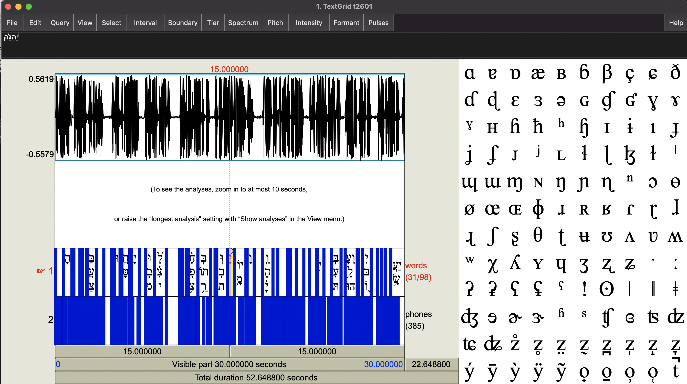
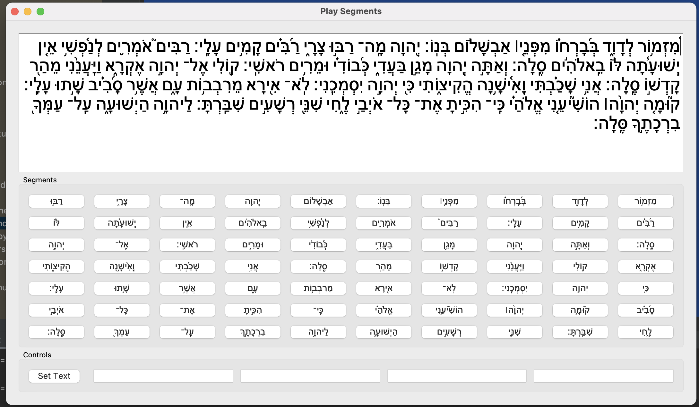

Montreal Forced Aligner is: "a command line utility for performing forced alignment of speech datasets using [Kaldi](http://kaldi-asr.org/)" as stated in their Github repo.

## Usage

For this particular case I used the following command:
```bash
mfa align tanakh_niqqud hebrew_words_english_sounds.dict english tanakh_niqqud_aligned/
```
lets review each parameter individually

## mfa align
With the installation complete along with its dependencies, we can use the "align" function from "mfa"

## tanakh_niqqud
This is the folder where we need to place pairs of files with extensions "lab": text and "wav": audio; for example:

```bash
(base) netmaster@netmaster-VirtualBox:~/mfa/mfa_data/tanakh_niqqud$ ls -l
total 5952
-rw-rw-r-- 1 netmaster netmaster     985 Shin 22 18:21 t2601.lab
-rw-rw-r-- 1 netmaster netmaster 2321890 Shin 22 18:21 t2601.wav
-rw-rw-r-- 1 netmaster netmaster    1455 Shin 22 18:21 t2602.lab
-rw-rw-r-- 1 netmaster netmaster 3763864 Shin 22 18:21 t2602.wav
```

### "lab" files
Each "lab" file must contain the text matching exactly its correspondng "wav" file. One step needed to produce this text was the replacement of the word "יְהוָה" (Yaweh) for "אֲדֹנָי" (Adonay) because the reader of the text follows that tradition while reading; also the characters like "-" and "׃" needed to be removed.
```bash
אַשְׁרֵי הָאִישׁ אֲשֶׁר לֹא הָלַךְ בַּעֲצַת רְשָׁעִים וּבְדֶרֶךְ חַטָּאִים לֹא עָמָד וּבְמוֹשַׁב לֵצִים לֹא יָשָׁב כִּי אִם בְּתוֹרַת אֲדֹנָי חֶפְצוֹ וּבְתוֹרָתוֹ יֶהְגֶּה יוֹמָם וָלָיְלָה וְהָיָה כְּעֵץ שָׁתוּל עַל פַּלְגֵי מָיִם אֲשֶׁר פִּרְיוֹ יִתֵּן בְּעִתּוֹ וְעָלֵהוּ לֹא יִבּוֹל וְכֹל אֲשֶׁר יַעֲשֶׂה יַצְלִיחַ לֹא כֵן הָרְשָׁעִים כִּי אִם כַּמֹּץ אֲ‍שֶׁר תִּדְּפֶנּוּ רוּחַ עַל כֵּן לֹא יָקֻמוּ רְשָׁעִים בַּמִּשְׁפָּט וְחַטָּאִים בַּעֲדַת צַדִּיקִים כִּי יוֹדֵעַ אֲדֹנָי דֶּרֶךְ צַדִּיקִים וְדֶרֶךְ רְשָׁעִים תֹּאבֵד
```

### hebrew_words_english_sounds.dict
A text file containing on each line a word and its phonetic representation

```bash
אֲדֹנָי AE0 D AH0 N EY1
אִם IH0 M
עַל AH0 L
עָמָד AA1 M AA1 D
אֲשֶׁר AE1 SH EH1 R
אַשְׁרֵי AE1 SH R EH1
בַּעֲצַת B AA1 AH0 T S AA1 T
בַּעֲדַת B AA1 AA1 D AA1 T
בַּמִּשְׁפָּט B AA1 M IH0 SH P AE2 TH
בְּעִתּוֹ B EH1 IH0 T OW0
בְּתוֹרַת B EH1 T OW1 R AA1 T
צַדִּיקִים T SH AA1 D IH0 K IY1 M
חַטָּאִים JH AH0 T AA1 IY1 M
חֶפְצוֹ JH EH1 F T S OW1
דֶּרֶךְ D EH1 R EH1 JH EH1
הָאִישׁ AY2 SH
הָלַךְ JH AH0 L AH0 JH
הָרְשָׁעִים AH0 R EH1 SH AH0 IH0 M
כַּמֹּץ K AH0 M OW1 T S
כְּעֵץ K EH1 T S
כֵּן JH EH1 N
כִּי K IH0
לֵצִים L EH1 T S IY1 M
לֹא L OW1
מָיִם M AA1 Y IH0 M
פַּלְגֵי P AA1 L G EH1
פִּרְיוֹ P IH0 R Y OW1
רְשָׁעִים R EH1 SH AA1 IH0 M
רוּחַ׃ R UH0 AH0 JH
שָׁתוּל SH AA1 T UW2 L
תִּדְּפֶנּוּ T IH0 D EH1 F EH1 N UH0
תֹּאבֵד T OW1 B EH1 D
וּבְדֶרֶךְ UW2 V D EH1 R EH1 JH
וּבְמוֹשַׁב UW2 V M OW1 SH AH0 V
וּבְתוֹרָתוֹ UW2 V T AO1 R AA1 T OW0
וָלָיְלָה V AA1 L AA1 Y L AH0
וְעָלֵהוּ V EH1 AA1 L EH1 UW2
וְחַטָּאִים V EH1 JH AH0 T AA1 IH0 M
וְדֶרֶךְ V EH1 D  EH1 R EH1 JH
וְהָיָה V EH1 JH AA1 Y AH0
וְכֹל V EH1 JH OW1 L
יַעֲשֶׂה Y AA1 AA1 S EH1
יַצְלִיחַ Y AA1 T S L IH0 AH0 JH
יָקֻמוּ Y AA1 K UH0 M UH0
יָשָׁב Y AA0 SH AA0 V
יֶהְגֶּה Y EH0 G EH0
יִבּוֹל Y IH0 B OW1 L
יִתֵּן Y IH0 T EH0 N
יוֹדֵעַ Y OW1 D EH0 AH0
יוֹמָם Y OW1 M AA0 M
```
This is one of the points where complications arise, mainly due to the lack of Hebrew language trained models. For the MontrealFA library in particular there were no trained models available for Hebrew, nor a lexicon of words-phonetics that I could find.
Fortunatelly, using the, very well trained, English Acoustic Model along with a lexicon that I build myself using english-phonetics for Hebrew words, the results were excellent.
The only issue now is to build or find this HebrewWord-English-phonemes pairs for all the words in the Tanakh.

For this part, using the translation table obtained from Biblehub, a lexicon for each chapter can be generated and used.


### english
this sets the acoustic model to use during the alignment process, so we will use the english model to match our english-phonemes. Maybe later, using all the matching words and phonemes times it would be interesting use MontrealFA to train an Hebrew model.

### tanakh_niqqud_aligned
Finally we provide the name of the folder where the results will appear.

## The results
The Force Alignment process, for the first two Psalms looks as follows:
```bash
(base) netmaster@netmaster-VirtualBox:~/mfa/mfa_data$ conda activate aligner
(aligner) netmaster@netmaster-VirtualBox:~/mfa/mfa_data$ mfa align tanakh_niqqud hebrew_words_english_sounds.dict english tanakh_niqqud_aligned/
All required kaldi binaries were found!
/home/netmaster/Documents/MFA/tanakh_niqqud/align.log
INFO - Setting up corpus information...
INFO - Number of speakers in corpus: 1, average number of utterances per speaker: 2.0
INFO - Parsing dictionary without pronunciation probabilities without silence probabilities
INFO - Creating dictionary information...
INFO - Setting up training data...
Generating base features (mfcc)...
Calculating CMVN...
INFO - Done with setup!
INFO - Performing first-pass alignment...
INFO - Calculating fMLLR for speaker adaptation...
INFO - Performing second-pass alignment...
INFO - All done!
```

which results in the following files on the output folder:

```bash
-rw-rw-r-- 1 netmaster netmaster 47230 Shin 22 21:42 t2601.TextGrid
-rw-rw-r-- 1 netmaster netmaster 33341 Shin 22 21:42 t2602.TextGrid
```

were each file contains the words and phonemes matchin timestamps in a format like:
```bash

File type = "ooTextFile"
Object class = "TextGrid"

xmin = 0 
xmax = 52.6488 
tiers? <exists> 
size = 2 
item []: 
    item [1]:
        class = "IntervalTier" 
        name = "words" 
        xmin = 0 
        xmax = 52.6488 
        intervals: size = 103 
        intervals [1]:
            xmin = 0 
            xmax = 0.07 
            text = "" 
        intervals [2]:
            xmin = 0.07 
            xmax = 0.76 
            text = "אַשְׁרֵי" 
        intervals [3]:
            xmin = 0.76 
            xmax = 1.45 
            text = "הָאִישׁ" 
```
this is where the forced alognment process finishes

## Example

"Psalm 1" is aligned using the following command:

```bash
mfa align --clean by-chapter/t2601 by-chapter/t2601/t2601.dict english by-chapter-aligned/t2601

```

## Testing the Results

The resulting ".TextGrid" file can be read with Praat,



I got to use the small python visualizer I coded too, just adjusted it a bit to be able to process the data exported as a table from Praat 

