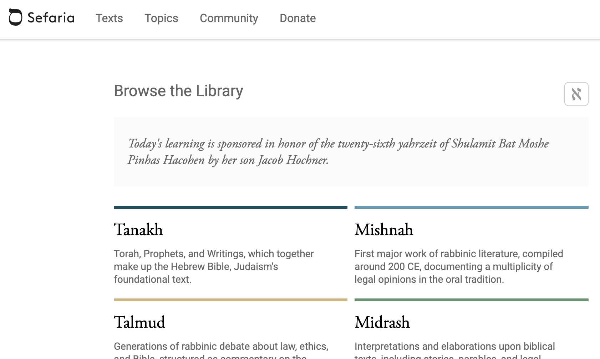

Even before starting this project, while starting the process of Hebrew language learning, I managed to find audio recordings and text for the Tanakh online.

# Text

Tanakh with and without Niqqud are available in the Mongo Database of the [Sepharia Library](https://www.sefaria.org/texts) from where it was conveniently extracted in JSON format.



# Audio

The audio, I got from [Talking Bibles](https://www.talkingbibles.org/)
and needed removing some bits that were not present in the text, like introductions containing the book and chapter.

# Lexicon & Dictionary

## Biblehub
[Biblehub](https://biblehub.com/) makes available its translation table for download, which provides precisely what its necessary for the read-along process. With proninciation for each word in the following format:

```bash
wə·ḏe·reḵ
```
which I needed to map to the phonetis used by the Montreal Forced Aligner:
```bash
W AE1 D EH0 R EH0 JH
```
 using a python script with the manually determined mappings:

 ```python
phonetic_equivalences = {
    "’a": "AE1",
    "‘a": "AA0",
    "ā": "AA1",
    "‘ā": "AA2",
    "a": "AH0",

    "b": "B",
    "ḇ": "V",

    "d": "D",
    "ḏ": "D",
    "ṣ": "DH",

    "ə": "AE1",
    "e": "EH0",
    "ê": "EH1",
    "‘ê": "EH2",

    "g": "G",
    chr(7713): "G",

    "h": "HH",
    "ḥ": "JH",

    "i": "IH0",
    "’i": "IH1",
    "‘i": "IH2",
    "î": "IY0",
    "’î": "IY1",
    "‘î": "IY2",

    "k": "K",
    "ḵ": "JH",

    "l": "L",
    "m": "M",
    "n": "N",

    "p": "P",
    "q": "K",
    "r": "R",

    "ś": "S",
    "š": "SH",

    "t": "T",
    "ṯ": "TH",
    "ṭ": "T",
    "ō": "OW0",
    "u": "UH0",
    "ū": "UW2",

    "w": "W",
    "y": "IY0",
}
```
The excel file provided has 40+ MB that Google Sheets and OpenOffice refused to open; so a Python script to separate it in Json files with a custom struct was also needed.

## The OSHB Hebrew Lexicon
I considered using the data available in [The OSHB Hebrew Lexicon](https://github.com/openscriptures/HebrewLexicon) available under the [Creative Commons Attribution 4.0 International](https://creativecommons.org/licenses/by/4.0/); but it had only the pronunciation lexixon for entries in its dictionary, missing a lot of conjugated words in the Tanakh. Biblehub has the complete information.